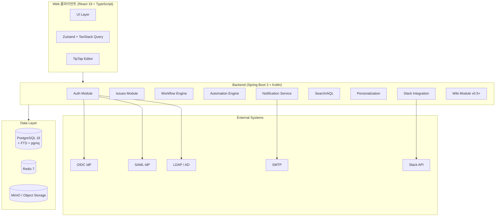

# 01. 비전 및 범위

## 1.1 시스템 비전

### 1.1.1 한 문장 비전

> Atlas는 사내 1,000명 규모 조직을 위한 협업 워크스페이스다.

### 1.1.2 비전을 구성하는 5가지 가치

| 가치 | 설명 |
|---|---|
| **실용성** | 사내 1,000명 규모에 최적화된 가볍고 빠른 시스템. 엔터프라이즈 과잉 설계 회피 |
| **경제성** | 매니지드 서비스 의존도 최소화, 연 운영비 2,000만원 이내 |
| **이식성** | 표준 Linux + Docker로 어디든 배포 (클라우드/온프레미스/하이브리드) |
| **Jira 호환** | AQL은 JQL과 99% 호환, 마이그레이션 도구 제공 |
| **AI 친화** | Claude Code로 1인 개발 가능. SDD/Skills가 AI가 읽도록 작성됨 |

### 1.1.3 안 하는 것 (Non-goals)

비전을 명확히 하기 위해 명시적으로 안 하는 것을 정의:

- **글로벌 SaaS**: 사내용이지 외부 판매용 아님
- **엔터프라이즈 무한 확장**: 1만 사용자 / 1억 이슈 가정 안 함 (필요 시 미래에 재설계)
- **퍼블릭 사이트 / 마케팅 페이지**: 위키도 사내용
- **모바일 네이티브 앱**: PWA로 대응
- **AI 자체 호스팅**: AI 기능은 외부 API (Anthropic) 사용

## 1.2 시스템 범위

### 1.2.1 In-Scope (Atlas Issues + 통합 영역)

**핵심 이슈 관리**

- 이슈/프로젝트/워크플로우/권한 관리
- 이슈 타입 (Epic/Story/Task/Subtask/Bug + 커스텀)
- 컴포넌트, 버전, 템플릿, 링크, 첨부, 멘션, 일정
- 에픽-스토리 계층, 백로그, 스프린트
- 칸반/스크럼 보드
- 타임라인/로드맵 (Gantt 뷰)

**가시화**

- 대시보드, 가젯, 리포트
- 번다운/번업/벨로시티/CFD 차트
- Cycle Time / Lead Time 분포

**자동화 & 통합**

- 자동화 규칙 엔진 (TCA: Trigger-Condition-Action)
- 알림 시스템 (이메일, 인앱, Slack, Teams, Webhook)
- AQL 검색 (JQL 호환)
- 필터 저장/공유, CSV/XLSX Export, CSV/JSON Import

**시간 관리**

- 시간 추적 (Worklog)
- 개인 캘린더 + iCal Export

**개인화**

- 사용자 프로필 (이름/아바타/타임존/부재중)
- 환경 설정 (테마/언어/단축키)
- 즐겨찾기, 최근 본 항목, 활동 피드
- 알림 구독 (전역 + 프로젝트별 오버라이드)

**인증 & 보안**

- 플러그형 인증 (LDAP/AD/SAML/OIDC/Local/OAuth)
- 2FA (TOTP + 백업 코드, WebAuthn 선택)
- 세션/토큰 관리 (JWT + Refresh + PAT)
- 감사 로그

**API & 확장**

- REST API
- Webhook (HMAC-SHA256 서명)
- WebSocket (STOMP, 실시간 알림)

### 1.2.2 In-Scope (Atlas Wiki, v0.5 별도)

Atlas Wiki는 v0.5에서 별도 SDD로 작성될 예정. 다음을 포함:

- 페이지 CRUD + 계층 구조 + 사이드바 트리
- 50종 블록 기반 에디터 (TipTap)
- Database (Table/Board/Calendar/Gallery/Timeline View)
- 백링크, 페이지 간 링크
- 댓글, 멘션 (Atlas Issues와 통합)
- Atlas Issues 임베드 (AQL Query Block)
- v0.5 후반에 실시간 협업 편집 (CRDT) 검토

### 1.2.3 Out-of-Scope

명시적으로 안 하는 것들:

| 영역 | 사유 |
|---|---|
| ITSM / Service Desk | Jira Service Management 영역. Phase 5+ 검토 |
| SLA 추적 | ITSM의 일부 |
| 인시던트 관리 | 별도 도구 권장 (PagerDuty/Opsgenie) |
| 자산 관리 (CMDB) | 별도 도구 권장 |
| 모바일 네이티브 앱 | PWA로 대응 |
| GraphQL API | Phase 3+ 검토 (선택) |
| 자체 AI 학습/호스팅 | Claude API 사용 |
| 플러그인 마켓플레이스 | 사내용이므로 불필요 |
| 다중 테넌트 (SaaS) | 단일 조직 사용 |
| 공개 사이트 / Custom Domain | 사내용 |

## 1.3 핵심 사용자 페르소나

### 1.3.1 페르소나 매트릭스

| 페르소나 | 역할 | 주요 사용 시나리오 |
|---|---|---|
| **개발자** | Assignee | 할당 이슈 상태 변경, PR 연동, 댓글, Worklog 등록 |
| **QA** | Reporter | 버그 등록, 첨부파일, 재현 단계 기록, 회귀 추적 |
| **PM / PO** | Project Lead | 백로그 관리, 스프린트 계획, 타임라인, 대시보드, 리포트 |
| **프로젝트 관리자** | Project Admin | 권한/워크플로우/자동화 설정 |
| **시스템 관리자** | Org Admin | 사용자/Provider/조직 설정, 감사 |
| **임원/외부 뷰어** | Viewer | 대시보드, 리포트 조회 (편집 권한 없음) |
| **외부 통합** | API Client | CI/CD에서 자동 이슈 생성, GitHub PR 연동 |
| **협력사** | Guest | Local 계정으로 제한된 프로젝트만 접근 |

### 1.3.2 페르소나별 1주 사용 패턴

**개발자 (가장 빈번 사용자)**

- 매일: 내게 할당된 이슈 확인, 상태 전환, 댓글
- 주 2~3회: 신규 이슈 등록 (버그/태스크)
- 주 1회: Worklog 등록, 스프린트 회고

**PM / PO**

- 매일: 보드 확인, 진행률 모니터링
- 주 1회: 백로그 정렬, 스프린트 계획
- 격주: 임원 보고용 타임라인/리포트 추출

**시스템 관리자**

- 월 1~2회: 신규 사용자 추가/제거 (LDAP 자동 동기화로 대부분 자동)
- 분기 1회: 권한 스킴/워크플로우 변경
- 필요 시: 감사 로그 검토

## 1.4 운영 환경 가정

### 1.4.1 사용자 환경

- 데스크톱 우선: 1920×1080 이상 해상도
- 모바일: 보조용 (보드 조회, 빠른 댓글, 알림 확인)
- 브라우저: Chrome/Edge/Safari/Firefox 최신 2버전
- 네트워크: 사내 광랜 (50Mbps+) 또는 VPN 외부 접근

### 1.4.2 부하 환경

- 동시 접속자 피크: 100명
- 일일 API 호출: 약 10만건
- 피크 RPS: 3~10 req/sec
- 이슈 증가 속도: 약 1,000건/주 (연 50,000건)
- 3년 누적 이슈: 약 100~150만 건

### 1.4.3 가용성 환경

- 사내 시스템이므로 업무 시간(09:00~18:00) 가용성 우선
- 점검은 야간/주말 가능
- SLA 99% (월 7시간 다운타임 허용)
- RPO 24시간 / RTO 1시간

## 1.5 시스템 모듈 개요

## 1.6 다음 챕터

- 구체적인 요구사항(FR/NFR)을 확인하려면 → [02. 요구사항](02-requirements.md)
- 기술 스택 선정 근거가 궁금하면 → [03. 기술 스택](03-tech-stack.md)
- 아키텍처 구성 다이어그램은 → [04. 시스템 아키텍처](04-architecture.md)
