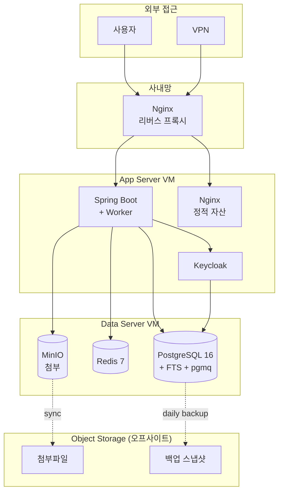
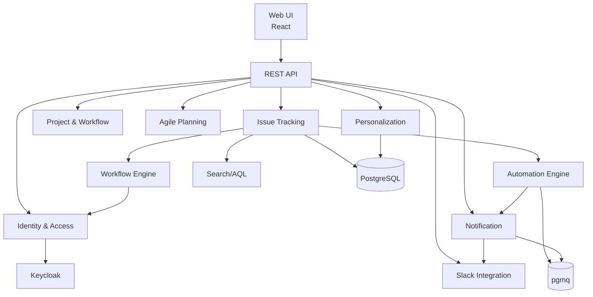

# 04. 시스템 아키텍처

## 4.1 아키텍처 원칙

| 원칙 | 의미 |
|---|---|
| **모듈러 모놀리스** | 단일 배포 단위, 명확한 모듈 경계 |
| **DB 중심** | PostgreSQL이 데이터 + 검색 + 큐 + 락 통합 |
| **이벤트 소싱 (경량)** | 도메인 이벤트를 DB 테이블에 기록 |
| **헥사고날** | 도메인 로직과 인프라 분리 (이식성) |
| **AI 친화** | 모듈 경계가 명확하여 Claude Code가 부분 작업 가능 |

## 4.2 바운디드 컨텍스트

| 컨텍스트 | 책임 |
|---|---|
| Identity & Access | 사용자, 조직, 그룹, 역할, 권한, 인증, LDAP 동기화 |
| Issue Tracking | 이슈, 댓글, 첨부, 관계, 커스텀 필드, 이력, 템플릿, 검색, Export/Import |
| Project & Workflow | 프로젝트, 컴포넌트, 버전, 워크플로우, 상태 전이 |
| Agile Planning | 스프린트, 보드, 백로그, 타임라인, 에픽, Worklog |
| Automation | 트리거-조건-액션 규칙, 실행 이력 |
| Notification & Dashboard | 알림 정책, 채널, 인앱 Inbox, 대시보드, 가젯, 리포트 |
| Slack Integration (v0.4) | Slack App, Bot, Unfurl, Slash, Interactive |
| Personalization (v0.4) | 프로필, 설정, 즐겨찾기, 활동, 캘린더 |
| Wiki (v0.5) | 페이지, 블록, Database, 백링크 |

## 4.3 배포 토폴로지



## 4.4 요청 흐름

### 4.4.1 동기 요청
```
Client → Nginx → Spring Boot → PostgreSQL/Redis
```

### 4.4.2 비동기 이벤트
```
Service → pgmq.send() → Worker (pgmq.read) → (알림/인덱싱/Webhook)
```

### 4.4.3 검색
```
Client → API → PostgreSQL FTS (tsvector + GIN)
```

### 4.4.4 Export
- 동기 (≤1만건): Client → API → POI → HTTP 스트리밍
- 비동기 (>1만건): API → 큐 → Worker → MinIO → 이메일 알림

### 4.4.5 WebSocket
```
Client ↔ Spring WebFlux STOMP ↔ Redis Pub/Sub (다중 노드 대비)
```

## 4.5 환경별 배포 옵션

| 환경 | 구성 |
|---|---|
| 사내 IDC | VMware/Proxmox VM 2대 + 사내 NAS |
| Naver Cloud ⭐ | VPC + Standard 서버 2대 + Object Storage |
| 하이브리드 | 운영=사내, 백업=Object Storage (오프사이트) |
| AWS Seoul | EC2 + EBS + S3 |
| 개발자 로컬 | Docker Compose 단일 호스트 |

## 4.6 모듈 의존성 다이어그램



## 4.7 다음 챕터

- 각 컨텍스트의 데이터 모델 → [05. 데이터 모델](05-data-model.md)
- 도메인 시나리오 흐름 → [06. 핵심 도메인 시나리오](06-scenarios.md)
- 인프라 구축 디테일 → [16. 인프라 / 배포 / 운영](16-infrastructure.md)
