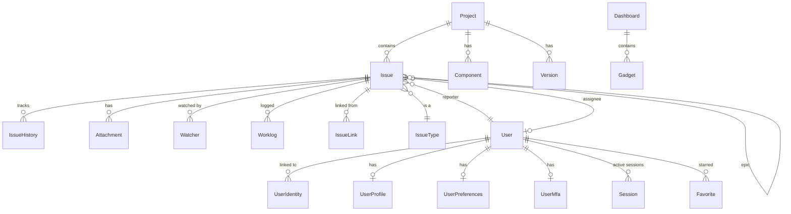

# 05. 데이터 모델

## 5.1 Issue (이슈) — 핵심 엔티티

| 필드 | 타입 | 설명 |
|---|---|---|
| id | BIGINT (PK) | 내부 ID |
| key | VARCHAR(20) | 사용자 노출 키 (PROJ-123) |
| project_id | BIGINT (FK) | 소속 프로젝트 |
| issue_type_id | BIGINT (FK) | 이슈 타입 |
| status_id | BIGINT (FK) | 현재 워크플로우 상태 |
| resolution_id | BIGINT (FK) NULL | 해결 사유 (FR-IS-07) |
| summary | VARCHAR(500) | 제목 |
| description | TEXT | 본문 (Markdown) |
| priority | SMALLINT | 우선순위 (1~5) |
| reporter_id | BIGINT (FK) | 보고자 |
| assignee_id | BIGINT (FK) NULL | 담당자 |
| labels | TEXT[] | 라벨 |
| component_ids | BIGINT[] | 컴포넌트 ID |
| affects_version_ids | BIGINT[] | 영향 버전 |
| fix_version_ids | BIGINT[] | 수정 버전 |
| parent_id | BIGINT (FK) NULL | 부모 이슈 (Subtask용) |
| epic_id | BIGINT (FK) NULL | 소속 Epic (FR-EP-01) |
| start_date | DATE NULL | 시작일 |
| due_date | DATE NULL | 종료일 |
| target_date | DATE NULL | 목표일 |
| story_points | DECIMAL NULL | 스토리 포인트 |
| rank | VARCHAR(50) | 백로그 정렬 키 (LexoRank) |
| original_estimate | INT NULL | 최초 추정 시간 (초) |
| remaining_estimate | INT NULL | 잔여 시간 (초) |
| time_spent | INT NULL | 실제 소요 시간 (초) |
| custom_fields | JSONB NOT NULL DEFAULT '{}' | 커스텀 필드 값 — `{field_key: value}` 형식. 타입/참조무결성은 ApplicationService 책임. GIN 인덱스(§5.14). 정의는 `custom_field_definitions` 참조 (FR-IS-10) |
| search_vector | tsvector (Generated) | FTS 검색용 |
| created_at / updated_at | TIMESTAMPTZ | 생성/수정 시각 |
| deleted_at | TIMESTAMPTZ NULL | 소프트 삭제 |

## 5.2 IssueType

표준 5종: Epic, Story, Task, Subtask, Bug. 조직별 커스텀 추가 가능.

| 필드 | 타입 | 설명 |
|---|---|---|
| id | BIGINT (PK) | 내부 ID |
| name | VARCHAR(50) | 타입 이름 |
| description | TEXT | 설명 |
| icon | VARCHAR(50) | 아이콘 이름 (lucide-react) |
| color | VARCHAR(7) | 색상 (HEX) |
| hierarchy_level | SMALLINT | 0=Subtask, 1=Standard, 2=Epic |
| is_subtask | BOOLEAN | Subtask 여부 |
| org_id | BIGINT (FK) | 소속 조직 (NULL=시스템 표준) |

## 5.3 Project

| 필드 | 타입 | 설명 |
|---|---|---|
| id | BIGINT (PK) | 내부 ID |
| key | VARCHAR(10) | 프로젝트 키 (PROJ) |
| name | VARCHAR(100) | 이름 |
| description | TEXT | 설명 |
| lead_id | BIGINT (FK) | 프로젝트 리드 |
| category | VARCHAR(50) | 카테고리 |
| workflow_scheme_id | BIGINT (FK) | 워크플로우 스킴 |
| permission_scheme_id | BIGINT (FK) | 권한 스킴 |
| notification_scheme_id | BIGINT (FK) | 알림 스킴 |
| issue_type_scheme_id | BIGINT (FK) | 이슈 타입 스킴 |
| next_issue_number | INT | 다음 이슈 번호 |
| require_2fa | BOOLEAN | 멤버 2FA 강제 |

## 5.4 Component / Version

### Component
| 필드 | 타입 | 설명 |
|---|---|---|
| id | BIGINT (PK) | ID |
| project_id | BIGINT (FK) | 소속 프로젝트 |
| name | VARCHAR(100) | 컴포넌트명 |
| description | TEXT | 설명 |
| lead_id | BIGINT (FK) NULL | 컴포넌트 리드 |
| default_assignee_id | BIGINT (FK) NULL | 기본 담당자 |

### Version
| 필드 | 타입 | 설명 |
|---|---|---|
| id | BIGINT (PK) | ID |
| project_id | BIGINT (FK) | 소속 프로젝트 |
| name | VARCHAR(50) | 버전명 (예: "1.0.0") |
| description | TEXT | 설명 |
| status | VARCHAR(20) | UNRELEASED / RELEASED / ARCHIVED |
| start_date | DATE NULL | 시작 |
| release_date | DATE NULL | 릴리즈 예정 |
| released_at | TIMESTAMPTZ NULL | 실제 릴리즈 |

## 5.5 Workflow (FSM 정의)

워크플로우는 상태(State)와 전이(Transition)로 구성된 FSM. YAML로 정의 가능.

```yaml
workflow:
  name: software-default
  states:
    - {id: todo, name: To Do, category: TODO}
    - {id: in-progress, name: In Progress, category: IN_PROGRESS}
    - {id: review, name: In Review, category: IN_PROGRESS}
    - {id: done, name: Done, category: DONE}
  transitions:
    - {from: todo, to: in-progress, name: Start Progress}
    - {from: in-progress, to: review, name: Submit for Review}
    - {from: review, to: in-progress, name: Request Changes}
    - {from: review, to: done, name: Approve}
    - {from: "*", to: todo, name: Reopen}
```

## 5.6 IssueHistory

| 필드 | 타입 | 설명 |
|---|---|---|
| id | BIGINT (PK) | ID |
| issue_id | BIGINT (FK) | 대상 이슈 |
| actor_id | BIGINT (FK) | 행위자 |
| event_type | VARCHAR(50) | FIELD_CHANGE / COMMENT / ATTACHMENT 등 |
| field_name | VARCHAR(100) NULL | 변경 필드 |
| old_value | JSONB NULL | 이전 값 |
| new_value | JSONB NULL | 새 값 |
| created_at | TIMESTAMPTZ | 시각 |

## 5.7 IssueTemplate / IssueLink / Attachment / Watcher

### IssueTemplate
| 필드 | 타입 | 설명 |
|---|---|---|
| id | BIGINT (PK) | ID |
| project_id | BIGINT (FK) | 프로젝트 |
| issue_type_id | BIGINT (FK) | 이슈 타입 |
| name | VARCHAR(100) | 템플릿명 |
| content | TEXT | 본문 템플릿 (Markdown + 변수) |

### IssueLink
| 필드 | 타입 | 설명 |
|---|---|---|
| id | BIGINT (PK) | ID |
| source_id | BIGINT (FK) | 출발 이슈 |
| target_id | BIGINT (FK) | 도착 이슈 |
| link_type | VARCHAR(30) | blocks / relates / duplicates / clones |

### Attachment
| 필드 | 타입 | 설명 |
|---|---|---|
| id | BIGINT (PK) | ID |
| issue_id | BIGINT (FK) | 대상 이슈 |
| uploaded_by | BIGINT (FK) | 업로더 |
| filename | VARCHAR(500) | 원본 파일명 |
| size_bytes | BIGINT | 크기 |
| mime_type | VARCHAR(100) | MIME |
| storage_key | VARCHAR(500) | MinIO 키 |

### Watcher
| 필드 | 타입 | 설명 |
|---|---|---|
| issue_id | BIGINT (FK, PK) | 이슈 |
| user_id | BIGINT (FK, PK) | 사용자 |
| auto_added | BOOLEAN | 자동 추가 여부 |

## 5.8 Epic 관리 (FR-EP-01~02)

- `Issue.epic_id`: 자식 이슈가 Epic 참조
- `Issue.parent_id`: Subtask가 부모 Story/Task 참조
- Epic 진행률 = (자식 중 Done) / (전체 자식)
- Epic 색상 (color) 으로 보드/타임라인에서 시각 구분

## 5.9 Worklog (FR-TT-01~02)

| 필드 | 타입 | 설명 |
|---|---|---|
| id | BIGINT (PK) | Worklog ID |
| issue_id | BIGINT (FK) | 대상 이슈 |
| author_id | BIGINT (FK) | 작업자 |
| time_spent_seconds | INT | 소요 시간 (초) |
| started_at | TIMESTAMPTZ | 작업 시작 시각 |
| comment | TEXT | 작업 설명 |
| visibility | VARCHAR(20) | PUBLIC / TEAM_ONLY / PRIVATE |

등록 시 자동으로 `Issue.time_spent`, `Issue.remaining_estimate` 업데이트.

## 5.10 LexoRank (FR-BL-01)

백로그 임의 정렬용. VARCHAR(50) 알파벳 문자열 (예: 'hzzzzz', 'i00000').

- 새 항목 생성: 최하단 rank 부여
- 이동: 위/아래 이웃 rank의 중간값 계산 후 부여
- 주 1회 백그라운드 rebalance (rank 문자열 길이 정규화)

자체 구현 (lexorank.kt 모듈).

## 5.11 Dashboard / Gadget (FR-DB-01~03)

### Dashboard
| 필드 | 타입 | 설명 |
|---|---|---|
| id | BIGINT (PK) | ID |
| owner_id | BIGINT (FK) | 소유자 |
| name | VARCHAR(100) | 이름 |
| share_scope | VARCHAR(20) | PRIVATE / TEAM / ORG / PUBLIC |
| share_target_ids | BIGINT[] | 공유 대상 |
| layout | JSONB | 가젯 배치 (grid layout) |

### Gadget
| 필드 | 타입 | 설명 |
|---|---|---|
| id | BIGINT (PK) | 가젯 인스턴스 ID |
| dashboard_id | BIGINT (FK) | 소속 대시보드 |
| gadget_type | VARCHAR(50) | 타입 (assigned_to_me 등) |
| position | JSONB | 위치 (x, y, w, h) |
| config | JSONB | 타입별 설정 |

### 표준 가젯 카탈로그
- assigned_to_me, filter_result, issue_count
- pie_chart, bar_chart, created_vs_resolved
- activity_stream, sprint_burndown
- text_widget, link_list

## 5.12 User 엔티티 (v0.4 확장)

| 필드 | 타입 | 설명 |
|---|---|---|
| id | BIGINT (PK) | 내부 ID |
| external_id | VARCHAR(255) | 주 Provider의 외부 ID |
| email | VARCHAR(255) UNIQUE | 이메일 (Verified) |
| email_verified | BOOLEAN | 이메일 인증 |
| username | VARCHAR(50) UNIQUE | 로그인용 (Local만) |
| password_hash | VARCHAR(255) NULL | Argon2id 해시 (Local만) |
| password_changed_at | TIMESTAMPTZ NULL | 패스워드 변경 시각 |
| primary_provider | VARCHAR(50) | 주 Provider ID |
| status | VARCHAR(20) | ACTIVE/INVITED/SUSPENDED/LOCKED/DEACTIVATED/DELETED |
| org_id | BIGINT (FK) | 소속 조직 |
| mfa_enabled | BOOLEAN | 2FA 활성화 |
| mfa_required | BOOLEAN | 2FA 강제 대상 |
| failed_login_count | INT | 연속 실패 |
| locked_until | TIMESTAMPTZ NULL | 계정 잠금 만료 |
| last_login_at | TIMESTAMPTZ NULL | 마지막 로그인 |
| deleted_at | TIMESTAMPTZ NULL | 삭제 (익명화 처리) |

## 5.13 v0.4 신규 엔티티 (요약)

| 엔티티 | 설명 | 상세 위치 |
|---|---|---|
| UserIdentity | 외부 Provider identity (1:N) | 19.5 |
| Session | 활성 세션 | 19.6 |
| PersonalAccessToken | PAT | 19.6 |
| UserMfa | 2FA 설정 | 19.7 |
| auth_audit_log | 인증 감사 로그 | 19.10 |
| UserProfile | 프로필 | 20.2 |
| UserPreferences | 환경 설정 | 20.3 |
| NotificationSubscription | 알림 구독 | 20.4 |
| Favorite | 즐겨찾기 | 20.5 |
| SlackWorkspace | Slack 워크스페이스 | 09.3 |
| SlackUserMapping | Atlas-Slack 매핑 | 09.3 |
| SlackChannelSubscription | 채널 ↔ 프로젝트 | 09.8 |

## 5.13b 커스텀 필드 정의 (FR-IS-10)

프로젝트별로 이슈에 부착할 커스텀 필드를 정의하는 마스터 테이블.

### CustomFieldDefinition

| 필드 | 타입 | 설명 |
|---|---|---|
| id | UUID (PK) | 정의 ID |
| project_id | BIGINT (FK) | 소속 프로젝트 |
| key | VARCHAR(50) | 필드 키 (URL-safe, 생성 후 불변). UNIQUE(project_id, key) WHERE deleted_at IS NULL |
| name | VARCHAR(100) | 표시명 |
| description | TEXT NULL | 설명 |
| field_type | VARCHAR(30) | FieldType enum (아래 10종) |
| is_required | BOOLEAN | 필수 여부 |
| display_order | INT | 이슈 폼 표시 순서 |
| is_active | BOOLEAN | 활성 여부 (비활성 = 신규 이슈에 노출 안 됨, 기존 값 보존) |
| deleted_at | TIMESTAMPTZ NULL | 소프트 삭제 |

**FieldType 10종 (1차)**: `SHORT_TEXT` · `LONG_TEXT` · `NUMBER` · `DATE` · `DATETIME` · `SINGLE_SELECT` · `MULTI_SELECT` · `CHECKBOX` · `RADIO` · `URL`. cross-BC 참조형(USER/GROUP/VERSION/COMPONENT picker)은 후속 타입 추가.

### CustomFieldOption

선택형(`SINGLE_SELECT` / `MULTI_SELECT` / `RADIO`) 정의의 선택지.

| 필드 | 타입 | 설명 |
|---|---|---|
| id | UUID (PK) | 선택지 ID |
| definition_id | UUID (FK) | 소속 정의. ON DELETE CASCADE |
| value | VARCHAR(200) | 선택지 값 |
| display_order | INT | 표시 순서 |

## 5.14 파티셔닝 / 인덱싱

100만 건 규모에서는 파티셔닝 불필요. 인덱스만으로 충분.

| 테이블 | 인덱스 |
|---|---|
| issue | (project_id, status_id), (assignee_id, status_id), (reporter_id), (epic_id), (parent_id) |
| issue | GIN on labels, component_ids, custom_fields, search_vector |
| issue | B-Tree on rank (백로그 정렬) |
| issue_history | (issue_id, created_at DESC) |
| worklog | (issue_id), (author_id, started_at) |
| auth_audit_log | (user_id, created_at DESC), (event_type) — 월 단위 파티션 |
| notification | (user_id, is_read, created_at DESC) |

## 5.15 ERD 개념도



## 5.16 다음 챕터

- 시나리오 흐름 → [06. 핵심 도메인 시나리오](06-scenarios.md)
- 워크플로우 엔진 → [07. 워크플로우 엔진](07-workflow-engine.md)
- 인증 엔티티 디테일 → [19. 인증 시스템](19-authentication.md)
- 개인화 엔티티 디테일 → [20. 개인화](20-personalization.md)
