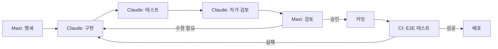

# 22. Claude Code 개발 환경

> **이 챕터는 v0.5.0의 핵심 신규 영역이다.** Atlas는 Maxi 1인이 Claude Code와 함께 개발하는 모델로 진행된다. 이 챕터는 그 개발 환경을 명세한다.

## 22.1 개발 모델

### 22.1.1 1인 + AI 모델

Atlas는 **Maxi 1인이 Claude Code를 보조 개발자로 활용**하여 개발한다. 전통적 팀 개발과 다음과 같이 다르다:

| 영역 | 전통적 팀 개발 | 1인 + Claude Code |
|---|---|---|
| 인력 | 백엔드 2 + 프론트 1 + PM 0.5 | Maxi 1명 |
| 의사결정자 | 여러 명 (논의 필요) | 1명 (즉시 결정) |
| 구현자 | 사람 | Claude Code (사람 검토) |
| 코드 리뷰 | PR 리뷰 | Claude 자가 검토 + Maxi 검토 |
| 일관성 | 사람 간 코드 스타일 차이 | Skills로 강제된 일관성 |
| 학습 비용 | 신입 교육 | Skills/CLAUDE.md 작성 |
| 컨텍스트 | 사람 머리속 | Skills + 코드 + CLAUDE.md |
| 휴가/병가 | 진행 중단 위험 | Maxi만 멈추면 됨 |

### 22.1.2 역할 분담

**Maxi (사람)이 하는 일**:
- 제품 의사결정 (어떤 기능 만들지)
- 아키텍처 결정 (어떻게 만들지)
- Claude Code 지시 (무엇을 만들지 명확히)
- 결과물 검토 (안전성, 정확성, UX)
- 사용자 인터뷰 (사내 동료 피드백)
- 운영 (배포, 모니터링)

**Claude Code가 하는 일**:
- 구현 (Maxi 명세를 코드로)
- 테스트 작성 (단위/통합/E2E)
- 문서화 (코드 옆 주석, README)
- 리팩토링 (Maxi 지시 하에)
- 디버깅 (로그 분석, 가설 제시)
- 라이브러리 조사 (Maxi 검토용 요약)

**둘 다 하는 일**:
- 코드 리뷰 (Claude 자가 + Maxi)
- 설계 의논 (Claude 제안 + Maxi 결정)

## 22.2 프로젝트 구조

### 22.2.1 디렉토리 트리

```
atlas/
├── CLAUDE.md                    # Claude Code 매 세션 자동 로드
├── README.md                    # 사람용 프로젝트 개요
├── docs/
│   ├── sdd/                     # SDD 챕터별 MD
│   ├── adr/                     # Architecture Decision Records
│   └── runbook/                 # 운영 가이드
├── .claude/
│   ├── skills/                  # 도메인별 SKILL.md
│   │   ├── atlas-workflow-engine/
│   │   ├── atlas-aql-parser/
│   │   ├── atlas-frontend-component/
│   │   ├── atlas-backend-feature/
│   │   ├── atlas-testing/
│   │   └── atlas-migration/
│   └── commands/                # Slash 명령어
│       ├── new-feature.md
│       ├── review-changes.md
│       ├── debug-issue.md
│       └── update-changelog.md
├── apps/
│   ├── web/                     # React 프론트엔드
│   └── admin/                   # 관리자 콘솔
├── backend/
│   ├── modules/                 # 바운디드 컨텍스트별
│   │   ├── identity-access/
│   │   ├── issue-tracking/
│   │   ├── project-workflow/
│   │   ├── agile-planning/
│   │   ├── automation/
│   │   ├── notification/
│   │   ├── slack-integration/
│   │   └── personalization/
│   └── shared/                  # 공통 코드
├── packages/                    # 프론트엔드 모노레포 패키지
│   ├── ui/
│   ├── design-tokens/
│   ├── api-client/
│   ├── auth/
│   ├── icons/
│   ├── markdown/
│   ├── i18n/
│   └── utils/
├── infra/
│   ├── docker-compose.yml
│   ├── docker-compose.dev.yml
│   ├── nginx/
│   └── scripts/
├── tests/
│   └── e2e/                     # Playwright 시나리오
└── tools/
    ├── eslint-config/
    ├── tsconfig/
    └── ktlint/
```

### 22.2.2 명명 규칙

| 영역 | 규칙 |
|---|---|
| Kotlin 패키지 | `com.atlas.{module}.{layer}` (예: `com.atlas.issue.api`) |
| Kotlin 파일 | PascalCase (예: `IssueController.kt`) |
| TypeScript 파일 | kebab-case (예: `issue-detail.tsx`) |
| 리액트 컴포넌트 | PascalCase 파일 + named export |
| 폴더 | kebab-case |
| 환경 변수 | `ATLAS_*` 접두사, SCREAMING_SNAKE_CASE |
| DB 테이블 | snake_case 복수형 (예: `issues`, `user_profiles`) |
| API 경로 | kebab-case (예: `/api/v1/personal-access-tokens`) |

## 22.3 CLAUDE.md (프로젝트 루트)

Claude Code가 **매 세션 시작 시 자동 로드**하는 파일. 프로젝트 전체에 적용되는 규칙을 담는다.

### 22.3.1 CLAUDE.md에 들어갈 내용

- 프로젝트 한 줄 요약
- 핵심 기술 스택
- 절대 금기사항 (NEVER 규칙)
- 코딩 스타일 (간략)
- 자주 쓰는 명령어 (테스트, 빌드, 린트)
- 주요 폴더 가이드
- 관련 문서 링크 (Skills, SDD)

전체 내용은 별도 산출 파일 [CLAUDE.md](../../CLAUDE.md) 참조.

## 22.4 Skills 카탈로그

프로젝트 Skills 는 `.claude/skills/` 에 있고 각 디렉터리의 `SKILL.md` 가 정본이다.
Claude Code 가 frontmatter `description` 의 조건에 맞을 때 자동 로드한다.

### 22.4.1 Skills 목록

**정본은 파일 트리다.** 이 챕터에 이름 사본 표를 두지 않는다 — 두 목록은 서로를 검사하지 않고,
도메인별 스킬(`atlas-*` 6종)은 실제로 만들어진 적이 없다. 실현된 형태는 **워크플로우 체인**이다.

| 구분 | 위치 | 성격 |
|---|---|---|
| 진입점 | `.claude/skills/bts/SKILL.md` | 자연어 요청 → 티어 판정 → 단계 라우팅 |
| 단계 스킬 | `.claude/skills/bts-*/SKILL.md` | start · spec · plan · review-plan · impl · codereview · merge |
| 리뷰 계약 | `.claude/skills/review/` | 전역 `review` 스킬이 되읽는 프로젝트 체크리스트 (`SKILL.md` 없음) |
| sub-agent | `.claude/agents/*.md` | 도메인 실행자 + 리뷰 전용 `code-reviewer` |

어느 단계가 어느 티어에서 도는지는 `CLAUDE.md §작업 티어` · 강제 여부는 `docs/rules/behavior-rules.md`.

### 22.4.2 Skill 작성 원칙

| 원칙 | 설명 |
|---|---|
| **명확한 트리거** | description에 정확한 사용 조건 명시 (Claude가 자동 로드 판단) |
| **구체적 예시** | 추상적 설명보다 코드 예시 |
| **반례 포함** | "이렇게 하지 마라" 도 명시 |
| **참조 파일** | 긴 명세는 별도 파일로, SKILL.md는 진입점 |
| **gerund 명명** | `creating-feature`, `writing-tests` 같은 동사 활용형 권장 (Anthropic 가이드) |

## 22.5 Slash 명령어 카탈로그

**`.claude/commands/` 는 존재하지 않는다.** 위 4종(`/new-feature` 등)은 도입되지 않았고,
그 역할은 Skills 가 흡수했다 — 사용자가 직접 치는 것은 **`/bts <자연어>` 하나**이고
나머지 `bts-*` 는 체인이 호출한다(직접 호출 금지).

전역 `~/.claude/skills/` 의 도구 스킬은 저장소 밖 자산이라 이 챕터의 범위가 아니다.

## 22.6 Phase 0 PoC를 Claude Code 환경에 맞춤 재정의

### 22.6.1 PoC 항목 (재정의)

기존 PoC 6개에 더해 Claude Code 환경 검증 항목 추가:

| 영역 | PoC 항목 | 기간 |
|---|---|---|
| 백엔드 | 워크플로우 엔진 FSM (Claude가 구현, Maxi 검토) | 3일 |
| 백엔드 | AQL 파서 + PostgreSQL 변환 | 3일 |
| 백엔드 | LexoRank 알고리즘 + 1,000개 부하 테스트 | 1일 |
| 백엔드 | AuthenticationProvider 인터페이스 + LDAP/SAML 구현 | 3일 |
| 백엔드 | pgmq 통합 (트랜잭션 일관성 검증) | 1일 |
| 프론트엔드 | React 19 + TanStack Router 호환성 | 1일 |
| 프론트엔드 | Gantt 차트 (자체 SVG vs 라이브러리 비교) | 2일 |
| 프론트엔드 | TipTap 50종 블록 구현 가능성 (v0.5 준비) | 2일 |
| 프론트엔드 | @dnd-kit 1,000개 백로그 드래그 부드러움 | 1일 |
| 프론트엔드 | STOMP WebSocket 재연결 안정성 | 1일 |
| **개발 환경** | **CLAUDE.md 효과성 (Claude가 규칙 준수)** | 2일 |
| **개발 환경** | **Skills 트리거 정확성** | 2일 |
| **개발 환경** | **Claude Code → Maxi 검토 사이클 시간** | 진행 중 측정 |

총 22일 (약 1개월). 기존 1개월 PoC 기간 내 가능.

## 22.7 Claude Code 친화적 코딩 규칙

전통적 코딩 규칙 위에 Claude Code 환경 특화 규칙 추가:

### 22.7.1 코드 스타일

| 규칙 | 사유 |
|---|---|
| 모든 public 함수에 KDoc/JSDoc | Claude가 사용 의도 파악 |
| TypeScript strict + noUncheckedIndexedAccess | 런타임 오류 컴파일 시점 차단 |
| Kotlin: non-null 기본, nullable은 명시적 | NPE 방지 |
| 함수 30줄 이내 (Kotlin · TypeScript 공통) | Claude 컨텍스트 효율 |
| Kotlin: 파일 300줄 이내 | Claude 컨텍스트 효율 |
| TypeScript: 컴포넌트 200줄 이내 | Claude 컨텍스트 효율 |
| 명확한 변수명 (`u` 대신 `user`) | Claude도 사람도 읽기 좋음 |
| 매직 넘버 금지, 상수로 추출 | 의도 명확화 |
| Early return 권장 | 가독성 |

### 22.7.2 테스트 규칙

| 규칙 | 사유 |
|---|---|
| **새 기능 = 테스트 먼저** (TDD) | Claude의 환각/오류를 테스트가 잡음 |
| 단위 60% / 통합 25% / E2E 15% | 전통 70/20/10보다 E2E 비중 ↑ |
| AAA 패턴 (Arrange-Act-Assert) | Claude가 일관성 있게 작성 |
| 한 테스트 = 한 가정 | 실패 원인 명확 |
| 테스트 이름 = 한국어 OK (`when_사용자_2FA_설정_then_QR코드_반환`) | 의도 명확 |

### 22.7.3 커밋 규칙

| 규칙 | 사유 |
|---|---|
| Conventional Commits (`feat:`, `fix:`, `refactor:` 등) | 자동 CHANGELOG 생성 |
| 한 커밋 = 한 가지 변경 | 롤백 용이 |
| 커밋 메시지 한국어 OK | 1인 개발 |
| Co-authored-by: Claude 추가 안 함 | 잡음 |

## 22.8 사람-AI 협업 인터페이스

### 22.8.1 의사결정 분기점

**Maxi 직접 결정 (Claude 자문):**
- 제품 비전 / 우선순위
- 새 라이브러리 도입
- 보안 정책
- 사용자 경험 (UX)
- 외부 통합 대상 선정

**Claude 자율 (Maxi 검토):**
- 코드 구조 (모듈 내부)
- 변수/함수명
- 테스트 케이스
- 작은 리팩토링
- 버그 픽스

**같이 결정:**
- 새 모듈 설계
- API 인터페이스
- DB 스키마
- 큰 리팩토링

### 22.8.2 검토 사이클



### 22.8.3 컨텍스트 관리

코드베이스가 커지면 Claude의 컨텍스트 한계가 문제. 다음 전략으로 분산:

| 전략 | 적용 |
|---|---|
| **모듈 단위 작업** | 한 번에 한 바운디드 컨텍스트만 |
| **Skills로 분리** | 도메인별 가이드를 SKILL.md로 분리, 필요 시만 로드 |
| **CLAUDE.md 압축** | 절대 규칙만 5KB 이내로 |
| **참조 파일 분리** | 긴 명세는 별도 .md, SKILL.md에서 참조 |
| **세션 분리** | 큰 작업은 여러 세션으로 (`/clear` 활용) |
| **Subagent (선택)** | Phase 3+에서 검토 (코드 리뷰어 / 테스트 작성자 분리) |

## 22.9 개발 일정 재산정 (1인 + AI)

### 22.9.1 단계별 일정

| 단계 | 기간 | Maxi 역할 | Claude 역할 |
|---|---|---|---|
| Phase 0 (PoC) | 1개월 | 명세, 검증 | 구현 |
| Phase 1 (MVP) | 2개월 | UX 결정, 검토 | 이슈 CRUD, 워크플로우, 인증 |
| Phase 2 (Core) | 2개월 | 권한 정책 | 스프린트, 백로그, 알림, 2FA |
| Phase 3 (Pro) | 2개월 | 자동화 룰 검증 | 자동화 엔진, 타임라인, 리포트 |
| Phase 4 (Polish) | 1.5개월 | 사내 베타 피드백 | SSO 확장, PDF, 캘린더 |
| **GA (Issues)** | **T+8.5개월** | | |
| Phase 5 (Wiki) | +9~12개월 | | TipTap 위키 확장 |
| GA (Wiki) | T+18~21개월 | | |

**기존 13개월 → 약 8.5개월** (~35% 단축)

### 22.9.2 단축 효과의 출처

| 영역 | 단축 폭 | 사유 |
|---|---|---|
| 보일러플레이트 코드 | -70% | Claude가 빠르게 생성 |
| 테스트 작성 | -60% | Claude가 패턴 학습 후 빠르게 작성 |
| 문서화 | -80% | 코드와 함께 자동 생성 |
| 디버깅 | -40% | 로그 분석 빠름 |
| 의사결정 | -50% | 1인 결정 |
| 코드 리뷰 | -30% | Claude 자가 검토 + Maxi |
| 새 기술 학습 | -50% | Claude가 요약 제공 |
| **UX 검토** | **0%** | **사람만 가능** |
| **사용자 인터뷰** | **0%** | **사람만 가능** |
| **버그 디버깅 (복잡)** | **-20%** | **사람의 직관 여전히 중요** |

## 22.10 비용 재산정

### 22.10.1 연간 TCO

| 항목 | 연 비용 |
|---|---|
| 인프라 (Naver Cloud) | 195만원 |
| Claude Code 구독 (Max 20x) | 약 250만원 |
| Maxi 운영 (0.2 FTE) | 약 1,500만원 |
| 라이선스/3rd-party | 50만원 |
| **합계** | **약 1,995만원/년** |

### 22.10.2 개발 비용 (일회성)

| 항목 | 비용 |
|---|---|
| Maxi 개발 8.5개월 (1 FTE) | 약 6,800만원 |
| Claude Code 구독 8.5개월 | 약 180만원 |
| Phase 0 PoC 인프라 | 약 30만원 |
| **합계** | **약 7,000만원** |

기존 가정 (3.5명 13개월) 약 6~8억원 대비 **약 1/10**.

### 22.10.3 BEP 분석

| 시나리오 | BEP |
|---|---|
| Jira Cloud Premium 1000명 (연 2.5억) 대체 | **약 6개월** |
| 사내 IT 인프라 비용만 (Atlas 자체 운영) | 즉시 |
| 외주 개발 (3억원) 대체 | 즉시 |

## 22.11 위험 요소 (Claude Code 환경 특화)

| 위험 | 영향 | 완화 |
|---|---|---|
| Claude의 환각 (잘못된 라이브러리/API 사용) | 버그 | Skills로 검증된 패턴 강제, 테스트 강화 |
| 컨텍스트 한계 (큰 작업 시 누락) | 일관성 깨짐 | 모듈 단위 작업, Skills 분리 |
| Maxi의 검토 부하 | 일정 지연 | Claude 자가 검토 강화, CI 자동화 |
| 보안 취약점 미인지 | 사고 | Trivy + Dependabot + Skills에 보안 규칙 명시 |
| Claude Code 서비스 장애 | 일시 중단 | 로컬 백업 (Claude API 직접 사용 가능) |
| Maxi 휴가/병가 | 진행 중단 | 1인 개발의 본질적 위험, 문서화로 완화 |
| 사용자 피드백 부족 (1인이라) | 잘못된 방향 | 사내 동료 정기 인터뷰 (월 1회) |
| 인수인계 어려움 (1인 지식) | 장기 위험 | SDD + Skills + CLAUDE.md로 지식 외화 |

## 22.12 비기능 요구사항 영향

Claude Code 환경에 따른 NFR 조정:

| NFR | 기존 가정 | v0.5.0 가정 |
|---|---|---|
| 개발 일정 | 13개월 | 8.5개월 |
| Phase 0 PoC | 6개 항목 | 13개 항목 (개발환경 검증 포함) |
| 테스트 비중 | 70/20/10 | 60/25/15 (E2E 강화) |
| 코드 일관성 | 사람 리뷰 의존 | Skills/CLAUDE.md 강제 |
| 문서화 비용 | 별도 작업 | 코드와 동시 생성 |
| 채용 필요 | 3명 | 0명 |
| 인수인계 가능성 | 사람-사람 | 사람-AI-사람 (SDD/Skills 필수) |

## 22.13 결정 사항 요약

| 결정 | 사유 |
|---|---|
| 1인 단독 + Claude Code | Maxi 본업 외 사이드, 채용 부담 회피 |
| CLAUDE.md + Skills 체계 | Claude의 도메인 학습 비용 외화 |
| Markdown SDD | docx 대비 Claude 접근성, Git 호환 |
| TDD 강화 (테스트 먼저) | Claude 환각/오류의 안전망 |
| 모듈러 모놀리스 | 컨텍스트 분리 용이 |
| E2E 비중 ↑ | LLM 코드의 회귀 안전망 |
| Conventional Commits | 자동 CHANGELOG, 일관성 |

## 22.14 관련 산출물

- [../../CLAUDE.md](../../CLAUDE.md) — 프로젝트 루트, 매 세션 자동 로드
- [../../.claude/skills/](../../.claude/skills/) — 도메인 Skills 6종
- [../../.claude/commands/](../../.claude/commands/) — Slash 명령 4종

## 22.15 다음 단계

- Phase 0 PoC 시작 (22.6.1 항목별로 진행)
- 각 PoC 결과를 ADR (Architecture Decision Record)로 기록
- v0.5 Wiki SDD 작성 (별도 문서)
